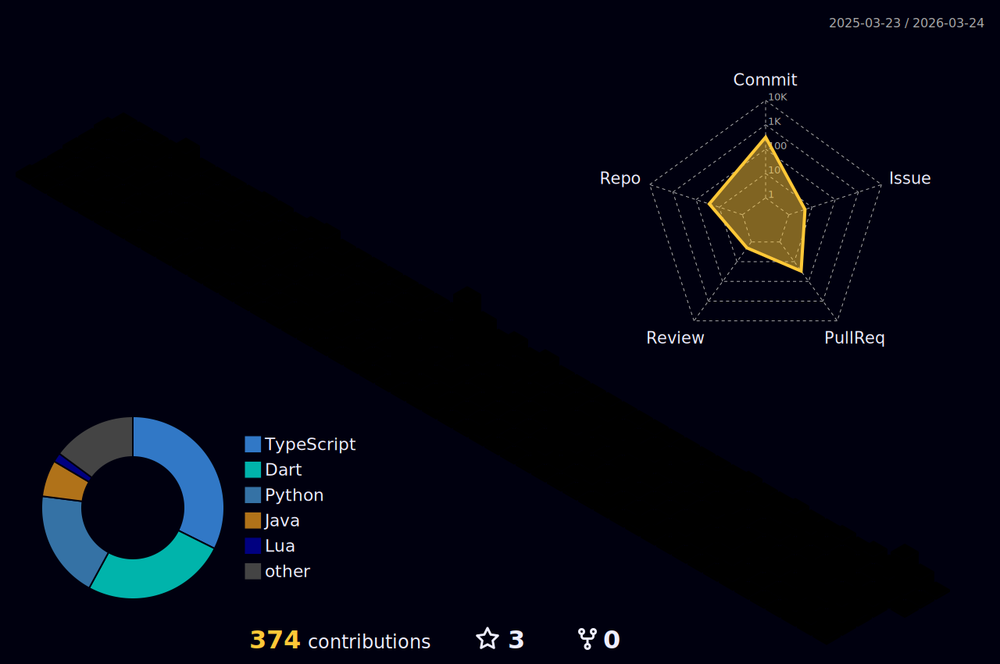

# 👋 Hi, I’m **C K**

### AI Systems Engineer | Backend Architect | Embedded Product Builder

🎓 **B.Tech CSE (Artificial Intelligence)** — VIT Pune (2023–2027)  
📊 CGPA: **8.52** | Last Semester SGPA: **9.38**

I design and ship **production-grade systems** — from low-level embedded firmware to distributed AI-powered cloud platforms.  
Strong focus on **backend engineering, real-time systems, and scalable architecture.**

---

## 📊 GitHub Activity

  

---

# 🚀 What I Build

- 🔹 Real-time AI voice agents (Streaming ASR → LLM → TTS pipelines)
- 🔹 Backend systems with production deployment
- 🔹 Secure authentication systems (TOTP, OAuth)
- 🔹 Embedded hardware products (ESP32, microcontrollers)
- 🔹 End-to-end full-stack platforms

---

# 💼 Experience

## **Reticulo Sports Technology** — Project Intern  
📍 Pune | Oct 2024 – Dec 2024  

### 🏸 ESP32 Badminton Shuttle Launcher
- Designed **closed-loop RPM control system** (Embedded C/C++)
- Achieved **1-second launch cycle**
- Reduced manufacturing cost by **80%**
- Coordinated 3D-printing vendors and integrated electronics
- Piloted with **All-India ranked players**
- Generated **50+ commercial pre-orders**

### 🔐 Offline OTP Generator (TOTP – RFC 6238)
- Implemented secure **Time-based OTP system**
- Deployed to **200+ users**
- Designed for fully offline authentication use cases

---

# 🧠 Featured Projects

## 🎙️ AI Conversational Telephony Agent

**Architecture:**  
Streaming ASR → LLM → Token-level TTS → Live Dashboard  

**Stack:** FastAPI, React, MongoDB Atlas  
**Integrations:** Twilio, LiveKit, Deepgram, OpenAI, Google Calendar  

### Highlights:
- Real-time AI voice call handling
- Natural conversational scheduling
- Full transcript generation
- Meeting automation
- Live monitoring dashboard
- Persistent call history system
- Designed for low-latency, scalable deployment

---

## 🎵 Emotion-Based Music Recommender

**Stack:** Flask, TensorFlow  

- Facial emotion detection + sentiment analysis
- ML inference → recommendation pipeline
- Model deployment via REST API

---

# 🛠️ Core Tech Stack

## 🧩 Languages

---

## 🏗 Backend & Systems

---

## 🌐 Frontend

---

## 🗄 Databases

---

## 🔌 Embedded

---

# 🧩 Engineering Foundations

- Data Structures & Algorithms
- Object-Oriented Design
- Operating Systems
- DBMS & SQL
- REST API Architecture
- System Design
- Authentication & Security (OAuth, TOTP)

---

# 🏆 Achievements

- 3+ Research Papers Published
- International Conference Paper Award
- 100+ LeetCode Problems Solved
- Microsoft L.S.C. Coordinator
- 2 Olympiad Medals
- 10+ Engineered Projects
- All-India Level Badminton Player

---

# 📫 Connect

- 🔗 LinkedIn:  
  https://www.linkedin.com/in/chaitanya-kalbhairav-60162028b  

- 📧 Email:  
  chaitanyakalbhairav@gmail.com
