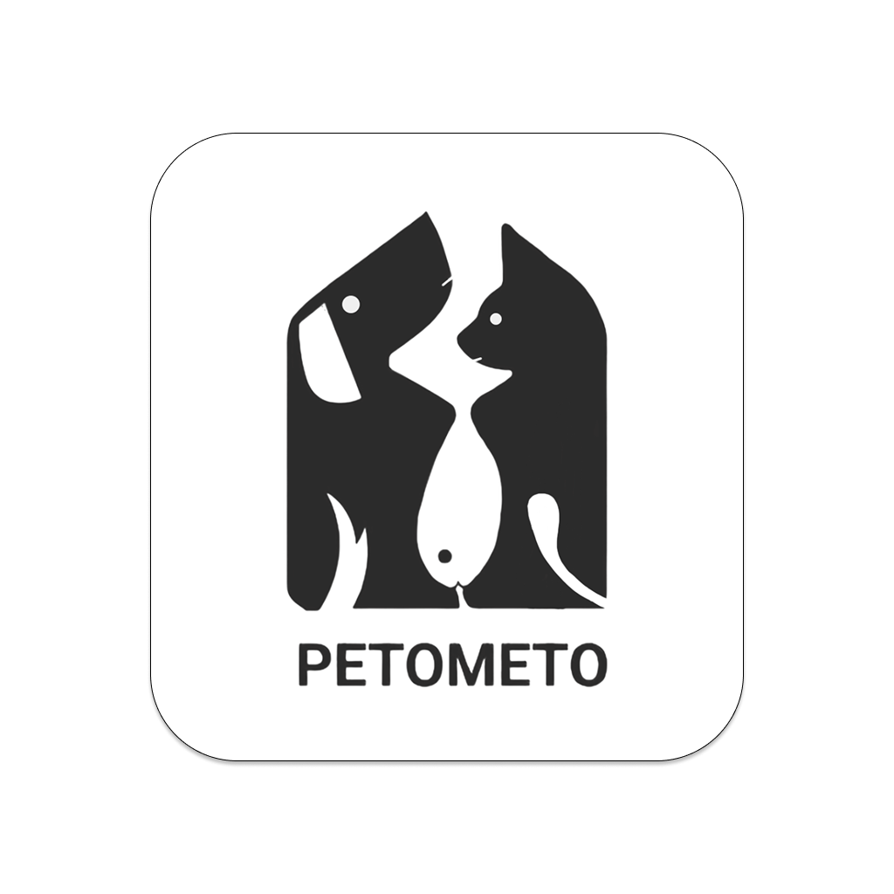

  
# 👋 Hi, I’m C K

**AI Systems Engineer | Backend Architect | Embedded Product Builder**

🎓 **B.Tech CSE (Artificial Intelligence)** — VIT Pune (2023–2027)  
📊 CGPA: **8.52** | Last Semester SGPA: **9.38**

*I design and ship **production-grade systems** — from embedded firmware to scalable AI-powered cloud platforms.*

**Backend Systems • AI Infrastructure • Embedded Engineering**

---

## 🛠️ Core Tech Stack

**🧩 Languages** 

**🏗 Backend & Cloud** 

**🌐 Frontend** 

**🗄 Databases** 

**🔌 Embedded** 

---

## 📊 GitHub Analytics

  

---

## 🌟 Flagship Project

  
  
  ### 🐾 Petometo: All-in-One Pet Care Platform
  
  *Architected and shipped the complete digital infrastructure for an early-stage startup as a **Freelance Software Engineer**.*
  
  [🌐 Website](https://petometo.com) • [🍎 iOS App](https://apps.apple.com/us/app/petometo/id6756202185) • [🤖 Android App](https://play.google.com/store/apps/details?id=com.petometo.app&hl=en_IN)
  
   
  
  
  
  
  
  

 

* 🚀 **Zero-to-One Architecture:** Built the startup's entire digital presence from scratch. Architected a multi-tenant platform featuring Flutter mobile apps, a Next.js admin dashboard, and a Dockerized Spring Boot backend exposing **340+ production APIs** (Dev → Staging → Prod workflow).
* 🤖 **AI Infrastructure:** Developed a GenAI content engine using automated AI crawlers and a LangChain video generator to create promotional media for service providers. Integrated a Vet AI assistant for symptom-based pet health insights.
* 🔐 **Enterprise Security:** Implemented a robust auth system using JWT with refresh token rotation, BCrypt-12, JTI revocation blacklisting, RBAC, and secure AWS S3 presigned upload pipelines.
* 📈 **Startup Impact:** Successfully launched the product to market, bootstrapping **40+ active app users**, generating 300+ initial website visitors, improving SEO from 0 to ~200 daily impressions, and orchestrating 50+ automated transactional email workflows.

<b>📊 View Backend Performance Metrics (JMeter)</b>

 

| Virtual Users | Requests | Avg Response | P95 Latency | Throughput | Error Rate |
| :---: | :---: | :---: | :---: | :---: | :---: |
| 1,000 | 10,000 | **~81 ms** | **~100 ms** | **~99 req/sec** | **~0.2%** |

*Performance optimizations include HTTP caching, ETag validation, and optimized DB queries.*

---

## 💼 Experience

### **Software Engineer Intern** | Reticulo Sports Technology  
📍 *Pune | Oct 2024 – Dec 2024*

* **ESP32 Shuttle Launcher:** Built a closed-loop RPM control system (Embedded C/C++) achieving a 1-second launch cycle. Reduced manufacturing costs by 80%, piloted with All-India ranked players, and generated 50+ pre-orders.
* **Offline OTP Generator:** Implemented RFC-6238 TOTP authentication, deploying secure offline auth for 200+ users.

---

## 🧠 Featured Projects

### 🌍 Travel AI — Multi-Agent Multi-Lingual Itinerary Orchestrator
**Stack:** FastAPI • LLMs • Python (asyncio) • gTTS
* **Multi-Agent Pipeline:** Decomposed unpredictable LLM generation into a strict, 6-stage structured pipeline (Discovery, Culinary Intelligence, Ranking, Clustering, Priority, Routing).
* **Multilingual & Audio Intelligence:** Engineered a native-script-enforced narration system with concurrent Text-to-Speech (TTS) generation for multi-language travel guides.
* **Production-Grade Reliability:** Implemented strict JSON schema validation, deterministic scoring outside the LLM, intelligent caching, and parallel async execution to drastically reduce latency.

### 🎙 AI Conversational Telephony Agent
**Stack:** FastAPI • React • MongoDB • Twilio • LiveKit • Deepgram
* Engineered a real-time AI voice agent capable of conversational voice calls, automated meeting scheduling, full transcript generation, and a live monitoring dashboard.

---

### 🏆 Achievements
🥇 **3+ Research Papers Published** | 🏅 **International Conference Paper Award** 💻 **150+ LeetCode Problems Solved** | ⚙️ **10+ Engineered Projects Built** 🏸 **All-India Level Badminton Player** | 🥇 **2 Olympiad Medals**

 
💡 <i>Always building • Always learning • Always shipping</i>

